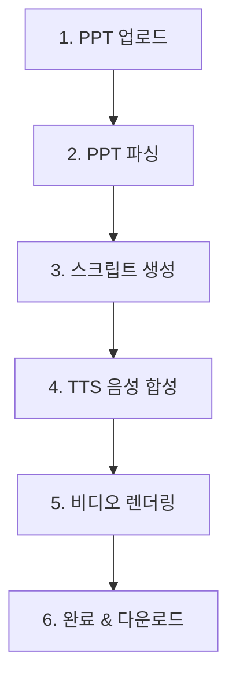

# 🎬 Vlooo PPT → 영상 변환 플로우 상세 문서

## 📊 전체 플로우 개요



---

## 1️⃣ 단계: PPT 업로드

### 📱 프론트엔드 (FileUploader 컴포넌트)

**파일**: `src/components/FileUploader.tsx`

**동작**:
1. 사용자가 PPT 파일 선택 (드래그&드롭 또는 클릭)
2. 파일 유효성 검사:
   - 확장자 체크: `.ppt`, `.pptx`
   - 파일 크기: 최대 100MB
3. `handleUploadComplete(file)` 호출 → `convert/page.tsx`로 전달

**상태 변화**:
- `uploadFile` 상태에 파일 저장
- `currentStep`: `'upload'` 유지

**UI 표시**:
- 파일명, 파일 크기 표시
- "업로드 완료" 메시지

---

## 2️⃣ 단계: PPT 파싱

### 📱 프론트엔드

**파일**: `src/app/convert/page.tsx` (라인 100-141)

**트리거**: `uploadFile` 상태 변경 감지 (useEffect)

**동작**:
1. `setCurrentStep('parsing')` → 화면 전환
2. API 호출:
   ```typescript
   const parseResponse = await apiClient.parsePpt(uploadFile, (progress) => {
     const mapped = 15 + Math.round(progress.percentage * 0.2);
     setProgress(Math.min(mapped, 35));
   });
   ```
3. 업로드 진행도 표시: 15% → 35%
4. 응답 처리:
   ```typescript
   setProjectId(parseResponse.projectId);  // "proj_abc123..."
   setSlides(parseResponse.slides);        // 슬라이드 배열
   ```
5. 자동으로 다음 단계로 진행: `setCurrentStep('scripting')`

**오류 처리**:
- 실패 시: `setError(errorMessage)`, `setCurrentStep('upload')`로 복귀

---

### 🔧 백엔드

**파일**: `backend/app/routes/ppt.py` (라인 1-150)

**엔드포인트**: `POST /api/parse-ppt`

**동작**:
1. **프로젝트 ID 생성**:
   ```python
   project_id = f"proj_{uuid.uuid4().hex[:12]}"
   ```

2. **진행도 업데이트**:
   ```python
   update_project_progress(
       project_id,
       "parsing",
       current=0,
       total=1,
       details="PPT 파일 분석 중..."
   )
   ```

3. **PPT 파싱 서비스 호출**:
   ```python
   parse_result = parse_ppt_file(file_content)
   ```
   - **파일**: `backend/app/services/ppt_parser.py`
   - **작업**:
     - 슬라이드 추출
     - 텍스트 추출
     - 이미지 추출
     - 메타데이터 생성

4. **슬라이드 모델 생성**:
   ```python
   slides = [
       SlideModel(
           slideId=s["slideId"],
           slideNumber=s["slideNumber"],
           title=s.get("title"),
           content=s.get("content", ""),
           imageUrls=s.get("imageUrls", []),
           notes=s.get("notes"),
       )
       for s in parse_result.get("slides", [])
   ]
   ```

5. **진행도 완료 업데이트**:
   ```python
   update_project_progress(
       project_id,
       "parsing",
       current=len(slides),
       total=len(slides),
       details=f"PPT 분석 완료 ({len(slides)}개 슬라이드)"
   )
   ```

6. **응답 반환**:
   ```json
   {
     "success": true,
     "data": {
       "projectId": "proj_abc123...",
       "totalSlides": 11,
       "slides": [...],
       "extractedText": "...",
       "metadata": {...}
     }
   }
   ```

---

## 3️⃣ 단계: AI 스크립트 생성

### 📱 프론트엔드

**파일**: `src/app/convert/page.tsx` (라인 143-181)

**트리거**: `slides` 상태 생성 + `currentStep === 'scripting'` 감지

**동작**:
1. API 호출:
   ```typescript
   const scriptResponse = await apiClient.generateScript(
     projectId, 
     slides, 
     {
       toneOfVoice: 'professional',
       language: 'ko',
     }
   );
   ```

2. 응답 처리:
   ```typescript
   setScripts(scriptResponse.scripts);
   setCurrentStep('voice-synthesis');
   ```

**진행도 폴링**:
- 3초마다 `/api/project-status/{projectId}` 호출
- 백엔드에서 `"슬라이드 1/11 처리 중..."` 받아서 UI 업데이트

---

### 🔧 백엔드

**파일**: `backend/app/routes/script.py` (라인 1-175)

**엔드포인트**: `POST /api/generate-script`

**동작**:
1. **요청 검증**:
   ```python
   if not request.projectId:
       raise HTTPException(status_code=400, detail="projectId가 필요합니다")
   ```

2. **슬라이드별 순차 처리** (각 슬라이드마다 1분 소요):
   ```python
   scripts = []
   for idx, slide in enumerate(slide_data, 1):
       # ⭐ 진행도 업데이트
       update_project_progress(
           request.projectId,
           "scripting",
           current=idx,
           total=len(slide_data),
           details=f"슬라이드 {idx}/{len(slide_data)} 처리 중..."
       )
       
       # AI 스크립트 생성 (OpenAI GPT-4o-mini 호출)
       script_result = generate_scripts(
           slides=[slide],
           tone=request.toneOfVoice,
           language=request.language,
       )
       scripts.extend(script_result)
   ```

3. **AI 스크립트 생성 서비스**:
   - **파일**: `backend/app/services/script_generator.py`
   - **우선순위: Ollama (로컬 Llama 3.1 모델)**:
     ```python
     url = f"{ollama_url}/api/chat"  # http://localhost:11434
     payload = {
         "model": "llama3.1",
         "messages": [
             {"role": "system", "content": "IT 전문가 톤으로..."},
             {"role": "user", "content": prompt}
         ],
         "stream": False,
         "options": {"temperature": 0.7}
     }
     response = requests.post(url, json=payload, timeout=120)  # ⏱️ 120초 타임아웃
     ```
   - **폴백: OpenAI GPT-4o-mini** (Ollama 실패 시 또는 OPENAI_API_KEY 설정 시)
   - **반환**: 한국어 나레이션 스크립트 텍스트 (30-60초 분량)

4. **응답 반환**:
   ```json
   {
     "success": true,
     "data": {
       "projectId": "proj_abc123...",
       "scripts": [
         {
           "slideId": "slide_1",
           "slideNumber": 1,
           "scriptText": "안녕하세요, 오늘은...",
           "duration": 15,
           "keywords": ["AI", "생성형", "구축"]
         },
         ...
       ],
       "totalDuration": 180
     }
   }
   ```

---

## 4️⃣ 단계: TTS 음성 합성

### 📱 프론트엔드

**파일**: `src/app/convert/page.tsx` (라인 183-218)

**트리거**: `scripts` 상태 생성 + `currentStep === 'voice-synthesis'` 감지

**동작**:
1. API 호출:
   ```typescript
   const ttsResponse = await apiClient.generateTts(
     projectId, 
     scripts, 
     {
       voiceName: 'Professional Male (한국어)',
       speed: 1.0,
     }
   );
   ```

2. 응답 처리:
   ```typescript
   setAudioUrls(ttsResponse.audioUrls);
   setCurrentStep('rendering');
   ```

---

### 🔧 백엔드

**파일**: `backend/app/routes/tts.py` (라인 1-266)

**엔드포인트**: `POST /api/generate-tts`

**동작**:
1. **voice_id 매핑**:
   ```python
   voice_id = _resolve_voice_id(request.voiceId, request.voiceName)
   # "Professional Male (한국어)" → Google TTS voice_id
   ```

2. **슬라이드별 순차 처리**:
   ```python
   for idx, script in enumerate(request.scripts, 1):
       # ⭐ 진행도 업데이트
       update_project_progress(
           request.projectId,
           "voice-synthesis",
           current=idx,
           total=len(request.scripts),
           details=f"슬라이드 {idx}/{len(request.scripts)} 음성 합성 중..."
       )
       
       # TTS 음성 생성
       audio_data = service.synthesize_speech(
           text=script.scriptText,
           voice_id=voice_id,
           speed=request.speed or 1.0,
       )
   ```

3. **Google TTS 서비스**:
   - **파일**: `backend/app/services/tts_service.py`
   - **gTTS 라이브러리 사용**:
     ```python
     from gtts import gTTS
     
     def synthesize_speech(text, voice_id, speed):
         tts = gTTS(text=text, lang='ko', slow=False)
         fp = io.BytesIO()
         tts.write_to_fp(fp)
         return fp.getvalue()  # MP3 바이너리 데이터
     ```

4. **R2 업로드 또는 Data URL**:
   ```python
   if r2_service:
       file_key = f"projects/{projectId}/audio/slide_{slideNumber}.mp3"
       audio_url = r2_service.upload_file(audio_data, file_key, "audio/mpeg")
   else:
       # R2 미사용 시 base64 인코딩
       b64 = base64.b64encode(audio_data).decode("utf-8")
       audio_url = f"data:audio/mpeg;base64,{b64}"
   ```

5. **응답 반환**:
   ```json
   {
     "success": true,
     "data": {
       "projectId": "proj_abc123...",
       "audioUrls": [
         {
           "slideId": "slide_1",
           "slideNumber": 1,
           "audioUrl": "https://r2.../audio/slide_1.mp3",
           "duration": 15.2
         },
         ...
       ],
       "totalDuration": 180.5
     }
   }
   ```

---

## 5️⃣ 단계: 비디오 렌더링

### 📱 프론트엔드

**파일**: `src/app/convert/page.tsx` (라인 220-260)

**트리거**: `audioUrls` 상태 생성 + `currentStep === 'rendering'` 감지

**동작**:
1. API 호출:
   ```typescript
   const videoResponse = await apiClient.renderVideo(
     projectId,
     slides,
     audioUrls,
     { 
       resolution: '1080p', 
       fps: 30, 
       outputFormat: 'mp4' 
     }
   );
   ```

2. 응답 처리:
   ```typescript
   setVideoUrl(videoResponse.videoUrl);
   setCurrentStep('completed');
   ```

---

### 🔧 백엔드

**파일**: `backend/app/routes/render.py` (라인 1-155)

**엔드포인트**: `POST /api/render-video`

**동작**:
1. **진행도 시작 업데이트**:
   ```python
   update_project_progress(
       request.projectId,
       "rendering",
       current=0,
       total=len(request.slides),
       details="비디오 렌더링 시작..."
   )
   ```

2. **비디오 렌더링 서비스 호출**:
   ```python
   result = render_video(
       project_id=request.projectId,
       slides=[s.model_dump() for s in request.slides],
       audio_urls=[a.model_dump() for a in request.audioUrls],
       resolution=request.resolution or "1080p",
       fps=request.fps or 30,
       output_format=request.outputFormat or "mp4",
   )
   ```

3. **비디오 렌더링 서비스**:
   - **파일**: `backend/app/services/video_renderer.py`
   - **FFmpeg 사용**:
     ```python
     # 1. 슬라이드 이미지 생성 (Pillow)
     for slide in slides:
         image = _create_placeholder_image(
             path=image_path,
             width=1920,  # 1080p
             height=1080,
             title=slide.get("title")
         )
     
     # 2. 오디오 다운로드
     for audio in audio_urls:
         audio_data = _read_bytes_from_url(audio["audioUrl"])
         audio_path.write_bytes(audio_data)
     
     # 3. concat 파일 생성 (슬라이드 + 오디오 듀레이션)
     _write_concat_file(slide_items, concat_list_path)
     
     # 4. FFmpeg 비디오 렌더링
     _run_ffmpeg([
         "ffmpeg",
         "-f", "concat",
         "-safe", "0",
         "-i", str(concat_list_path),
         "-i", str(final_audio_path),
         "-c:v", "libx264",
         "-preset", "medium",
         "-crf", "23",
         "-c:a", "aac",
         "-b:a", "192k",
         "-shortest",
         str(output_path)
     ])
     ```

4. **진행도 완료 업데이트**:
   ```python
   update_project_progress(
       request.projectId,
       "rendering",
       current=len(request.slides),
       total=len(request.slides),
       details="렌더링 완료!"
   )
   ```

5. **R2 업로드 또는 로컬 서빙**:
   ```python
   try:
       r2_service = get_r2_service()
       file_key = f"projects/{projectId}/video/final.mp4"
       video_url = r2_service.upload_file(
           output_path.read_bytes(),
           file_key,
           "video/mp4",
       )
   except:
       # 로컬 서빙
       media_dir = Path(os.getenv("MEDIA_DIR", "./media"))
       target_path = media_dir / f"{projectId}_final.mp4"
       target_path.write_bytes(output_path.read_bytes())
       video_url = f"http://localhost:8001/media/{target_path.name}"
   ```

6. **응답 반환**:
   ```json
   {
     "success": true,
     "data": {
       "projectId": "proj_abc123...",
       "videoUrl": "http://localhost:8001/media/proj_abc123_final.mp4",
       "videoSize": 15728640,
       "duration": 180.5,
       "resolution": "1080p",
       "renderStatus": "completed"
     }
   }
   ```

---

## 6️⃣ 단계: 완료 & 다운로드

### 📱 프론트엔드

**파일**: `src/components/ConversionProgressModal.tsx`

**동작**:
1. `currentStep === 'completed'` && `videoUrl` 존재 감지
2. 완료 팝업 표시:
   - "✅ 변환 완료!"
   - "모든 변환 작업이 완료되었습니다!"
   - "📊 대시보드에서 결과 확인" 버튼

3. 대시보드로 이동:
   ```typescript
   <Link href={`/dashboard?project=${projectId}`}>
     📊 대시보드에서 결과 확인
   </Link>
   ```

---

### 📱 프론트엔드 (대시보드)

**파일**: `src/app/dashboard/page.tsx` (추정)

**동작**:
1. 프로젝트 목록 조회
2. 완료된 프로젝트 표시
3. **다운로드 버튼**:
   ```typescript
   <a href={videoUrl} download={`${projectId}_video.mp4`}>
     ⬇️ MP4 다운로드
   </a>
   ```

---

## 🔄 실시간 진행도 업데이트 시스템

### 백엔드: `project_progress` 메모리 딕셔너리

**파일**: `backend/main.py` (라인 83-100)

```python
# 글로벌 딕셔너리
project_progress = {}

def update_project_progress(project_id, stage, current=0, total=0, details=""):
    """진행 상태 업데이트"""
    project_progress[project_id] = {
        "stage": stage,
        "current": current,
        "total": total,
        "details": details,
        "timestamp": datetime.utcnow().isoformat(),
    }

def get_project_progress(project_id):
    """진행 상태 조회"""
    return project_progress.get(project_id, {})
```

**엔드포인트**: `GET /api/project-status/{project_id}`

```python
@app.get("/api/project-status/{project_id}")
async def get_project_status(project_id: str):
    progress = get_project_progress(project_id)
    return {
        "projectId": project_id,
        "stage": progress.get("stage", "unknown"),
        "current": progress.get("current", 0),
        "total": progress.get("total", 0),
        "details": progress.get("details", ""),
        "timestamp": progress.get("timestamp", ""),
    }
```

---

### 프론트엔드: 3초 폴링

**파일**: `src/app/convert/page.tsx` (라인 56-98)

```typescript
useEffect(() => {
  if (!projectId || currentStep === 'upload' || currentStep === 'completed') {
    clearInterval(pollingIntervalRef.current);
    return;
  }

  const pollProjectStatus = async () => {
    const response = await fetch(
      `${process.env.NEXT_PUBLIC_API_URL}/api/project-status/${projectId}`
    );
    const data = await response.json();

    if (data.current > 0 && data.total > 0) {
      setDetailedProgress({
        current: data.current,
        total: data.total,
        stage: data.stage,
        details: data.details,
      });
    }
  };

  pollProjectStatus();
  pollingIntervalRef.current = setInterval(pollProjectStatus, 3000);

  return () => clearInterval(pollingIntervalRef.current);
}, [projectId, currentStep]);
```

---

### UI 표시

**파일**: `src/components/ConversionProgressModal.tsx` (라인 135-145)

```tsx
{detailedProgress && detailedProgress.total > 0 && (
  <div className="text-xs text-gray-600 space-y-1 bg-gray-50 p-2 rounded">
    <p className="font-semibold">
      {detailedProgress.current}/{detailedProgress.total}
    </p>
    <p className="text-gray-600">{detailedProgress.details}</p>
  </div>
)}
```

**예시 표시**:
```
11/11
슬라이드 11/11 처리 중...
```

---

## ⚠️ 현재 문제점 및 해결 방안

### 문제 1: Ollama/Llama 응답 지연

**증상**: 스크립트 생성이 11/11에서 멈춤  
**원인**: Ollama Llama 3.1 모델 응답 지연 (타임아웃 120초 이미 설정됨)  
**영향**: 변환 프로세스 전체 중단

**해결 방안**:
1. Ollama 서비스 상태 확인:
   ```bash
   curl http://localhost:11434/api/tags
   ```

2. 11번째 슬라이드 데이터 로그 확인 (특수 문자/긴 텍스트 등)

3. OpenAI 폴백 테스트 (환경변수 설정):
   ```bash
   # .env 파일
   OPENAI_API_KEY=sk-xxx...
   ```

4. 에러 로깅 강화:
   ```python
   except Exception as e:
       print(f"❌ [CRITICAL] Slide {idx}/{total} 실패: {str(e)}")
       raise HTTPException(status_code=500, detail=f"스크립트 생성 실패: {str(e)}")
   ```

---

### 문제 2: 백엔드 재시작 시 진행 상태 손실

**증상**: 백엔드 재시작하면 `project_progress` 딕셔너리 초기화  
**원인**: 인메모리 저장 방식  
**영향**: 진행 중인 변환의 상태 추적 불가

**해결 방안**:
1. **Redis 도입**:
   ```python
   import redis
   r = redis.Redis(host='localhost', port=6379, db=0)
   
   def update_project_progress(project_id, ...):
       r.set(f"progress:{project_id}", json.dumps({...}))
   ```

2. **파일 기반 저장**:
   ```python
   import json
   
   def update_project_progress(project_id, ...):
       (MEDIA_DIR / f"{project_id}_progress.json").write_text(
           json.dumps({...})
       )
   ```

---

## 📊 시간 예상

| 단계 | 소요 시간 (11장 기준) |
|------|---------------------|
| PPT 파싱 | ~5초 |
| 스크립트 생성 | ~11분 (슬라이드당 1분) |
| TTS 음성 합성 | ~30초 (슬라이드당 ~3초) |
| 비디오 렌더링 | ~2분 |
| **총 소요 시간** | **약 13-14분** |

---

## 🎯 다음 액션 아이템

1. ✅ Ollama 타임아웃 이미 설정됨 (120초)
2. ⬜ Ollama 서비스 상태 및 11번째 슬라이드 로그 확인
3. ⬜ 에러 핸들링 강화 (상세 로그 추가)
4. ⬜ 작은 PPT (3-5장)로 전체 플로우 테스트
5. ⬜ Redis 또는 파일 기반 진행 상태 저장
6. ⬜ 프로덕션 배포 준비

---

**작성일**: 2026-02-11  
**작성자**: GitHub Copilot  
**버전**: 1.0
