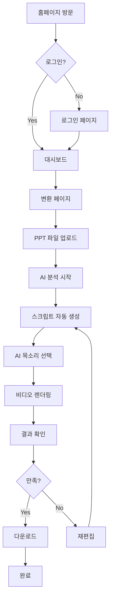

# [기능 명세서] Vlooo - PPT 기반 AI 발표 영상 생성 플랫폼

## 1. 시스템 개요

**목표**: PPT 문서를 IT 전문가 페르소나가 발표하는 고품질 영상으로 자동 변환

**주요 타겟**: B2C (취준생, 강사, 1인 창업자, 직장인)

**핵심 기술**: 
- Frontend: Next.js 14, React 18, TypeScript, TailwindCSS
- Backend: Python FastAPI, OpenAI GPT-4o-mini, ElevenLabs TTS
- Infrastructure: Cloudflare (Workers, R2, Pages)
- Video Processing: FFmpeg, Remotion

**현재 상태**: MVP 개발 완료 (2026년 2월 9일 기준)

---

## 2. 구현 완료 기능 (Implemented Features)

### 2.1 PPT 분석 및 데이터 구조화 (Smart Parsing) ✅

**[슬라이드 추출]**
- python-pptx 기반 PPT 파일 파싱
- 슬라이드별 텍스트 콘텐츠 추출
- 고화질 슬라이드 이미지 생성 (PNG)
- 메타데이터 추출 (제목, 작성자, 생성일)

**[데이터 구조화]**
```python
{
  "slides": [
    {
      "slide_number": 1,
      "title": "슬라이드 제목",
      "text_content": "본문 내용",
      "image_url": "slide_1.png",
      "notes": "발표자 노트"
    }
  ],
  "metadata": {
    "total_slides": 10,
    "title": "프레젠테이션 제목",
    "author": "작성자"
  }
}
```

**[API 엔드포인트]**
- `POST /api/parse-ppt`: PPT 파일 업로드 및 파싱
- `GET /api/health`: 서비스 상태 확인

---

### 2.2 AI 발표 시나리오 생성 (Expert Scripting) ✅

**[IT 전문가 페르소나]**
- OpenAI GPT-4o-mini 기반 스크립트 자동 생성
- Professional / Friendly / Casual 톤 선택 가능
- 슬라이드별 자연스러운 발표 대본 생성

**[스크립트 구성 요소]**
```
- 오프닝: "안녕하세요, 오늘은 [주제]에 대해 말씀드리겠습니다"
- 본문: 슬라이드 내용 기반 상세 설명
- 전환: "다음 슬라이드에서는...", "이어서 보시겠습니다"
- 클로징: "지금까지 [주제]에 대해 알아보았습니다"
```

**[자동 기능]**
- 슬라이드당 발표 시간 자동 계산 (텍스트 길이 기반)
- 핵심 키워드 자동 추출
- 스크립트 최적화 (중복 제거, 자연스러운 흐름)

**[API 엔드포인트]**
- `POST /api/generate-script`: 슬라이드 기반 AI 스크립트 생성

---

### 2.3 AI 음성 합성 및 영상 렌더링 (TTS & Video Rendering) ✅

**[TTS 음성 합성]**
- ElevenLabs API 연동
- 다양한 한국어 AI 목소리 제공:
  - 전문가 남성 (Professional Male)
  - 전문가 여성 (Professional Female)
  - 친근한 남성 (Friendly Male)
  - 친근한 여성 (Friendly Female)
- 음성 속도 조절 (0.5x ~ 2.0x)
- 고음질 오디오 생성 (MP3)

**[비디오 렌더링]**
- FFmpeg 기반 영상 합성
- 슬라이드 이미지 + AI 음성 동기화
- 해상도 옵션: 720p / 1080p / 4K
- 출력 포맷: MP4, WebM

**[렌더링 프로세스]**
```
1. 슬라이드 이미지 준비
2. AI 음성 파일 생성
3. FFmpeg concat 파일 생성
4. 최종 비디오 합성
5. Cloudflare R2 업로드
```

**[API 엔드포인트]**
- `POST /api/generate-tts`: AI 음성 생성
- `GET /api/tts/voices`: 사용 가능한 목소리 목록
- `POST /api/render-video`: 최종 비디오 렌더링

---

### 2.4 파일 저장 및 관리 (Cloud Storage) ✅

**[Cloudflare R2 연동]**
- boto3 기반 S3 호환 API 사용
- 파일 업로드/다운로드 자동화
- Public URL 자동 생성

**[저장 파일 유형]**
```
/uploads/
  - {project_id}.pptx        # 원본 PPT
/slides/
  - {project_id}/slide_1.png # 슬라이드 이미지
/audio/
  - {project_id}/audio_1.mp3 # AI 음성 파일
/videos/
  - {project_id}/final.mp4   # 최종 영상
```

**[로컬 폴백]**
- R2 연결 실패 시 로컬 `/media` 디렉토리 사용
- 개발 환경 로컬 테스트 지원

---

### 2.5 사용자 인증 시스템 (Authentication) ✅

**[NextAuth.js 기반 인증]**
- JWT 세션 전략
- Credentials Provider (이메일/비밀번호)
- 다중 디바이스 지원 (PC, 모바일, 태블릿)

**[데모 계정]**
```
이메일: demo@vlooo.ai
비밀번호: demo1234
```

**[보호된 라우트]**
- `/dashboard/*` - 로그인 필수
- Middleware 기반 자동 리다이렉트

**[세션 관리]**
- 자동 로그인 유지 (JWT 토큰)
- 로그아웃 기능
- 세션 기반 UI 렌더링 (Navigation 컴포넌트)

---

### 2.6 웹 인터페이스 (Web UI) ✅

**[홈페이지]** (`/`)
- 히어로 섹션: "내 PPT가 전문가의 영상으로 흐르다"
- 주요 기능 소개
- CTA 버튼: "지금 시작하기", "요금제 보기"

**[변환 페이지]** (`/convert`)
- **6단계 워크플로우**:
  1. **업로드**: 드래그앤드롭 PPT 파일 업로드 (최대 100MB)
  2. **파싱**: 슬라이드 분석 및 데이터 추출
  3. **스크립트 생성**: AI 발표 대본 자동 작성
  4. **음성 선택**: AI 목소리 선택 및 속도 조정
  5. **렌더링**: 최종 비디오 합성
  6. **완료**: 미리보기 및 다운로드

**[진행 상황 표시]**
- 실시간 진행률 바 (0-100%)
- 단계별 상태 아이콘 (대기/진행중/완료)
- 상세 프로세스 설명 텍스트

**[에러 처리]**
- 3단계 심각도: Error / Warning / Info
- 재시도 버튼
- 개발 모드 상세 에러 정보

**[결과 화면]**
- 비디오 플레이어 (HTML5 Video)
- 오디오 파일 목록 (재생/다운로드)
- 스크립트 미리보기 (복사 기능)
- 공유 버튼 (준비중)

**[로그인/로그아웃]** (`/login`, `/logout`)
- 이메일/비밀번호 폼
- 에러 메시지 표시
- 자동 리다이렉트

**[가격 페이지]** (`/pricing`)
- **단건 결제**: 1회 / 5회 / 10회
  - 9,900원 ~ 69,000원
- **구독형**: 월 10건 / 30건 / 무제한
  - 49,000원/월 ~ 249,000원/월
- "결제 준비중" 배너 및 비활성화 버튼
- 향후 Stripe/토스/포트원 연동 준비

**[대시보드]** (`/dashboard`)
- 기본 레이아웃 구성
- 프로젝트 리스트 (구현 예정)
- 사용량 통계 (구현 예정)

---

## 3. 사용자 흐름 (User Flow)



**상세 단계**:
1. **파일 업로드** (5초): 로컬 PPT 파일 드래그앤드롭
2. **AI 분석** (30초-1분): 슬라이드 구조 분석 및 텍스트 추출
3. **스크립트 생성** (1-2분): IT 전문가 톤 발표 대본 자동 작성
4. **음성 합성** (1-3분): ElevenLabs AI 목소리로 음성 생성
5. **비디오 렌더링** (2-5분): FFmpeg 기반 슬라이드+음성 합성
6. **결과 확인** (즉시): 웹 플레이어 미리보기 및 다운로드

---

## 4. 기술 스택 및 인프라 (Tech Stack)

### 4.1 Frontend

| 기술 | 버전 | 용도 |
|------|------|------|
| **Next.js** | 14+ | React 프레임워크, App Router |
| **React** | 18+ | UI 컴포넌트 |
| **TypeScript** | 5+ | 타입 안정성 |
| **TailwindCSS** | 3+ | 스타일링 |
| **NextAuth.js** | 4+ | 인증 시스템 |
| **Zustand** | 4+ | 상태 관리 (변환 워크플로우) |
| **Axios** | 1+ | HTTP 클라이언트 |

### 4.2 Backend

| 기술 | 버전 | 용도 |
|------|------|------|
| **FastAPI** | 0.100+ | Python Web Framework |
| **python-pptx** | 0.6+ | PPT 파싱 |
| **OpenAI SDK** | 1.0+ | GPT-4o-mini API |
| **ElevenLabs SDK** | Latest | TTS 음성 합성 |
| **boto3** | 1.34+ | Cloudflare R2 연동 |
| **FFmpeg** | 4.4+ | 비디오 인코딩 |
| **Uvicorn** | 0.20+ | ASGI 서버 |

### 4.3 Infrastructure

| 서비스 | 용도 | 상태 |
|--------|------|------|
| **Cloudflare Pages** | Frontend 호스팅 | 설정 완료 |
| **Cloudflare Workers** | Serverless API | 준비 완료 |
| **Cloudflare R2** | 파일 스토리지 | 연동 완료 |
| **Cloudflare D1** | 사용자 데이터베이스 | 미연동 |

### 4.4 Testing

| 도구 | 용도 | 커버리지 |
|------|------|----------|
| **Playwright** | E2E 테스트 | 홈, 로그인, 가격 페이지 |
| **Chrome Headless** | 브라우저 테스트 | 데스크톱 |
| **Device Emulation** | 모바일 테스트 | Pixel 7 |

---

## 5. API 엔드포인트 명세

### 5.1 PPT 처리

#### `POST /api/parse-ppt`
**요청**:
```typescript
Content-Type: multipart/form-data
{
  file: File (PPT/PPTX)
}
```

**응답**:
```typescript
{
  "project_id": "uuid-v4",
  "slides": [
    {
      "slide_number": 1,
      "title": "슬라이드 제목",
      "text_content": "본문",
      "image_url": "https://r2.../slide_1.png"
    }
  ],
  "metadata": {
    "total_slides": 10,
    "title": "PPT 제목"
  }
}
```

---

### 5.2 AI 스크립트 생성

#### `POST /api/generate-script`
**요청**:
```typescript
{
  "slides": [...],
  "tone": "professional" | "friendly" | "casual",
  "language": "ko"
}
```

**응답**:
```typescript
{
  "scripts": [
    {
      "slide_number": 1,
      "text": "안녕하세요...",
      "duration_seconds": 15,
      "keywords": ["AI", "자동화"]
    }
  ],
  "total_duration": 300
}
```

---

### 5.3 TTS 음성 합성

#### `POST /api/generate-tts`
**요청**:
```typescript
{
  "scripts": [...],
  "voice_id": "korean_professional_male",
  "speed": 1.0
}
```

**응답**:
```typescript
{
  "audio_files": [
    {
      "slide_number": 1,
      "audio_url": "https://r2.../audio_1.mp3",
      "duration": 15.3
    }
  ]
}
```

#### `GET /api/tts/voices`
**응답**:
```typescript
{
  "voices": [
    {
      "id": "korean_professional_male",
      "name": "전문가 남성",
      "language": "ko",
      "gender": "male"
    }
  ]
}
```

---

### 5.4 비디오 렌더링

#### `POST /api/render-video`
**요청**:
```typescript
{
  "project_id": "uuid-v4",
  "slides": [...],
  "audio_files": [...],
  "resolution": "1080p" | "720p" | "4k",
  "format": "mp4" | "webm"
}
```

**응답**:
```typescript
{
  "video_url": "https://r2.../final.mp4",
  "duration": 300,
  "resolution": "1920x1080",
  "file_size_mb": 45.2
}
```

---

## 6. 데이터 모델 (Data Models)

### 6.1 프로젝트 (Project)
```typescript
interface Project {
  id: string;              // UUID
  user_id: string;         // 사용자 ID
  title: string;           // PPT 제목
  created_at: Date;        // 생성일
  updated_at: Date;        // 수정일
  status: 'parsing' | 'scripting' | 'rendering' | 'complete';
  ppt_url: string;         // 원본 PPT URL
  video_url?: string;      // 최종 영상 URL
  metadata: {
    total_slides: number;
    duration_seconds: number;
    resolution: string;
  }
}
```

### 6.2 슬라이드 (Slide)
```typescript
interface Slide {
  slide_number: number;
  title: string;
  text_content: string;
  image_url: string;
  notes?: string;
  script?: {
    text: string;
    duration: number;
    keywords: string[];
  };
  audio_url?: string;
}
```

### 6.3 사용자 (User)
```typescript
interface User {
  id: string;
  email: string;
  name: string;
  created_at: Date;
  subscription_tier: 'free' | 'light' | 'standard' | 'business';
  usage: {
    total_conversions: number;
    total_minutes: number;
  }
}
```

---

## 7. 환경 변수 (Environment Variables)

### Frontend (`.env.local`)
```bash
# API
NEXT_PUBLIC_API_URL=http://localhost:8000

# NextAuth
NEXTAUTH_SECRET=your-secret-key
NEXTAUTH_URL=http://localhost:3000
```

### Backend (`.env`)
```bash
# OpenAI
OPENAI_API_KEY=sk-...

# ElevenLabs
ELEVENLABS_API_KEY=...

# Cloudflare R2
CLOUDFLARE_R2_ACCOUNT_ID=...
CLOUDFLARE_R2_ACCESS_KEY_ID=...
CLOUDFLARE_R2_SECRET_ACCESS_KEY=...
CLOUDFLARE_R2_BUCKET_NAME=vlooo-storage

# Database (향후)
DATABASE_URL=...
```

---

## 8. 개발 및 배포 가이드

### 8.1 로컬 개발 환경 설정

```bash
# Frontend
cd c:\vibe\Vlooo
npm install
npm run dev  # http://localhost:3000

# Backend
cd backend
pip install -r requirements.txt
uvicorn main:app --reload  # http://localhost:8000
```

### 8.2 E2E 테스트 실행

```bash
# Playwright 브라우저 설치
npx playwright install

# 테스트 실행
npm run test:e2e          # 헤드리스 모드
npm run test:e2e:ui       # UI 모드
npm run test:e2e:report   # HTML 리포트
```

### 8.3 프로덕션 빌드

```bash
# Frontend
npm run build
npm start

# Backend
uvicorn main:app --host 0.0.0.0 --port 8000
```

---

## 9. 향후 개발 계획 (Roadmap)

### Phase 2: 프로젝트 관리 강화 (Q1 2026)
- [ ] Cloudflare D1 데이터베이스 연동
- [ ] 프로젝트 리스트 대시보드 구현
- [ ] 버전 히스토리 관리
- [ ] 프로젝트 검색 및 필터링

### Phase 3: 편집 기능 고도화 (Q2 2026)
- [ ] 실시간 스크립트 편집 UI
- [ ] 음성 속도/톤 미세 조정
- [ ] 슬라이드별 타이밍 조절
- [ ] 자막 스타일 커스터마이징

### Phase 4: 리소스 라이브러리 (Q2 2026)
- [ ] 저작권 프리 이미지 라이브러리 통합
- [ ] 배경음악(BGM) 추천 및 삽입
- [ ] 템플릿 시스템 구축

### Phase 5: 분석 및 공유 (Q3 2026)
- [ ] 영상 공유 전용 URL 생성
- [ ] 시청 통계 (조회수, 평균 시청 시간)
- [ ] 슬라이드별 이탈률 분석
- [ ] 소셜 미디어 공유 기능

### Phase 6: AI 고도화 (Q3-Q4 2026)
- [ ] Vision AI 차트/다이어그램 해석
- [ ] 다국어 지원 (영어, 중국어, 일본어)
- [ ] AI 추천 스크립트 개선
- [ ] 음성 감정 표현 (강조, 억양)

### Phase 7: 결제 시스템 (Q4 2026)
- [ ] Stripe 결제 연동
- [ ] 토스페이먼츠 연동
- [ ] 포트원 연동
- [ ] 구독 관리 시스템

---

## 10. 알려진 제한 사항 및 개선 필요 사항

### 현재 제한 사항
1. **데이터베이스 미연동**: 프로젝트 영구 저장 불가 (세션 기반)
2. **실시간 편집 제한**: 스크립트 수정 후 전체 재생성 필요
3. **결제 시스템 없음**: 가격 페이지만 존재, 실제 과금 불가
4. **모바일 최적화 부족**: 데스크톱 우선 UI
5. **프로젝트 공유 불가**: URL 공유 기능 미구현

### 개선 필요 사항
1. **E2E 테스트 안정화**: 로그인/가격 페이지 테스트 실패 해결
2. **에러 핸들링 강화**: 네트워크 오류, API 타임아웃 처리
3. **성능 최적화**: 번들 크기 감소, 이미지 최적화
4. **접근성 개선**: ARIA 라벨, 키보드 네비게이션
5. **국제화(i18n)**: 다국어 지원 인프라

---

## 11. 라이선스 및 의존성

### 오픈소스 라이선스
- Next.js: MIT
- React: MIT
- FastAPI: MIT
- python-pptx: MIT

### 상용 API 사용
- OpenAI GPT-4o-mini: 사용량 기반 과금
- ElevenLabs: 월간 구독 또는 사용량 과금
- Cloudflare R2: 저장 용량 + 트래픽 과금

---

## 12. 문의 및 지원

**개발팀**: SEHYUNICT-SeBit  
**GitHub**: https://github.com/SEHYUNICT-SeBit/Vlooo  
**버전**: MVP v0.1.0  
**최종 업데이트**: 2026년 2월 9일

---

**주요 문서**:
- [메뉴 시스템 가이드](README_MENU.md)
- [API 문서](API_DOCUMENTATION.md)
- [Cloudflare 배포 체크리스트](CLOUDFLARE_DEPLOY_CHECKLIST.md)
- [백엔드 README](backend/README.md)
